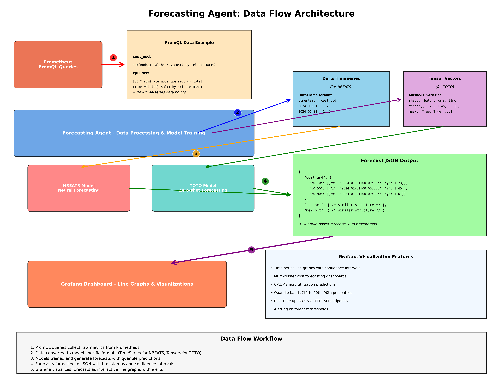

# FinOps Agent

FinOps forecasting agent that ingests Kubernetes cost/utilization metrics from Prometheus and generates forecasts using Datadog's TOTO zero-shot model. 

> Currently in development

> Helm & K8s deployment files work as-is, just build Docker image, push, and apply deployment. 

> The default value of Helm chart also includes a public image of finops-agent in ghcr and so optionally you can skip docker build & push.

**Note**: 
- Optimizers are broken at the moment.
- NBEATS adapter specific code will be removed completely.

## Architecture



## Project Structure

```
forecasting-agent/
├── src/
│   ├── main.py                        # Main application entry point
│   ├── collectors/
│   │   └── prometheus.py              # Prometheus metrics collector
│   ├── adapters/
│   │   ├── forecasting/
│   │   │   ├── toto_adapter.py        # Datadog TOTO zero-shot model
│   │   │   ├── nbeats_adapter.py      # NBEATS forecasting model
│   │   │   └── prophet_adapter.py     # Prophet forecasting model
│   │   ├── prometheus_toto_adapter.py # Direct Prometheus to TOTO conversion
│   │   └── forecast_format_converter.py # Output format conversion
│   ├── metrics/
│   │   ├── metric_types.py            # Metric classification
│   │   └── promql_queries.py          # PromQL query definitions
│   ├── validation/
│   │   └── forecast_validator.py      # Model accuracy validation
│   └── optimizers/
│       └── idle_capacity.py           # Cost optimization logic
├── toto/                              # Upstream Datadog/Toto utility code
│   └── ...                            # TOTO model utilities and helpers
├── config.yaml                        # Main configuration file
├── deployments/
│   └── kubernetes/
│       └── deployment.yaml            # Kubernetes deployment
└── docs/
    ├── architecture.png               # Architecture diagram
    ├── appendix.md                    # Additional documentation
    └── TOTO_TENSOR_SHAPE_GUIDE.md     # TOTO tensor format guide
```

### TOTO Model Integration

The `toto/` folder contains utility code directly from upstream [Datadog/Toto](https://github.com/Datadog/TOTO) repository. This provides the necessary utilities and helper functions to leverage the TOTO zero-shot forecasting model, including tensor operations, data preprocessing, and model inference capabilities.

## Quick Start
#### Prerequisites

- Access to a Prometheus instance **or** any Prometheus-compatible HTTP endpoint.  
  This can be:
  - A direct Prometheus server (`http://prometheus:9090`) running inside your cluster.
  - The “KOF” proxy that exposes a Prometheus-style API.

### Docker Deployment

```bash
# Build and push Docker image
docker build -t forecasting-agent:latest .
docker push your-registry/forecasting-agent:latest
```

### Kubernetes

* Patch the [kubernetes deployment resource](./deployments/kubernetes/deployment.yaml) with your public {docker-image} of Finops application.

```bash
# Apply Kubernetes deployment
kubectl apply -f deployments/kubernetes/deployment.yaml
```

### Local Development

```bash
# Install dependencies
pdm install

# Run directly
PYTHONPATH=src pdm run python -m forecasting_agent.main config.yaml

# Or with debugging
PYTHONPATH=src pdm run python -m debugpy --listen 5678 --wait-for-client -m forecasting_agent.main config.yaml
```

### Helm

```bash
# Install FinOps Agent using Helm chart
helm install finops-agent ./helm

# Install in specific namespace
helm install finops-agent ./helm --namespace finops --create-namespace

# Install with custom Prometheus URL
helm install finops-agent ./helm \
  --set config.collector.url=http://your-prometheus:9090
```
#### Grafana Dashboard

The Helm chart includes a bundled Grafana instance with pre-configured forecasting dashboards.

* Port forward to access Grafana UI
kubectl port-forward service/finops-agent-grafana 3001:3001

`
Default: Go to http://localhost:3001 - {user: admin, pass: finops123}
`

Dashboard Features
- 9 forecasting panels (4 node-level + 5 cluster-level)
- 7-day forecast horizon

## Configuration

Configure via `config.yaml`:

```yaml
# Prometheus data source
collector:
  type: prometheus
  url: http://localhost:8082
  disable_ssl: true
  lookback_days: 4
  step: "30m"
  timeout: 300
  max_retries: 3

# Model configuration
models:
  type: toto
  forecast_horizon: 7  # days ahead
  quantiles: [0.1, 0.5, 0.9]
  
  toto:
    checkpoint: Datadog/Toto-Open-Base-1.0
    device: cpu  # or cuda
    context_length: 4096
    num_samples: 256

# Agent runtime settings
agent:
  interval: 300  # seconds between forecast updates

# API server
api:
  host: "0.0.0.0"
  port: 8081
```

## API Endpoints

HTTP API available at `http://localhost:8081`:

### Get Cluster Forecasts
`GET /metrics/{cluster_name}`

Returns forecast data for a specific cluster:

```json

{
  "forecasts": [
    {
      "metric": {
        "__name__": "cost_usd_per_cluster_forecast",
        "clusterName": "aws-ramesses-regional-0",
        "node": "cluster-aggregate",
        "quantile": "0.10",
        "horizon": "14d"
      },

      "values": [10.5, 11.2, 9.8],
      "timestamps": [1640995200000, 1640998800000, 1641002400000]
    }
    {
      .....
    }
  ],
  "metadata": {
    "total_metrics": 9,
    "total_forecasts": 63,
    "horizon_days": 7,
    "quantiles": [
      0.1,
      0.5,
      0.9
    ]
  }
}
```

### List All Metrics Across Clusters
`GET /metrics`

Returns all available metrics across all clusters:

```json
{
  "metrics": {
    "aws-ramesses-regional-0": {
      "forecasts": [
        {
          "metric": {
            "__name__": "cost_usd_per_cluster_forecast",
            "clusterName": "aws-ramesses-regional-0",
            "node": "cluster-aggregate",
            "quantile": "0.10",
            "horizon": "14d"
          },
          "values": [
            0.221269,
            .....,
          ],
          "timestamps": [
            1752461807000,
            ....,
          ]
        },
        {
          .......
        }
      ],
      "metadata": {
        "total_metrics": 9,
        "total_forecasts": 63,
        "horizon_days": 7,
        "quantiles": [
          0.1,
          0.5,
          0.9
        ]
      }
    }
  },
  "clusters_count": 1,
  "total_forecast_entries": 1
}

```

### List Available Clusters
`GET /clusters`

Returns list of clusters with forecast data:

```json
{"clusters": ["prod-cluster", "staging-cluster"], "count" : 2}
```

## Documentation

For detailed implementation details and advanced configuration options, see [docs/appendix.md](docs/appendix.md).

For TOTO tensor shape specifications and data format details, refer to [docs/TOTO_TENSOR_SHAPE_GUIDE.md](docs/TOTO_TENSOR_SHAPE_GUIDE.md).

## 📊 Validation & Accuracy

The agent includes built-in forecast validation:

- **Train/Test Split**: Configurable ratio (default 70/30)
- **Metrics**: MAPE, MAE, RMSE calculated automatically
- **Frequency**: Runs every N forecast cycles (configurable)
- **Logging**: Detailed accuracy reports in application logs

```
INFO: Component cost: MAPE=12.34%, MAE=0.0456, RMSE=0.0789
INFO: Component cpu_usage: MAPE=8.91%, MAE=2.1234, RMSE=3.4567
INFO: Validation completed for 6 components across 2 clusters
```

## 🔧 Troubleshooting

**Prometheus Connection Failed**
- Verify Prometheus URL in `config.yaml`
- Check network connectivity: `curl http://your-prometheus:9090/api/v1/query?query=up`
- Review agent logs for detailed error messages

**High MAPE Values**
- Increase `lookback_days` for more training data
- Adjust `forecast_horizon` to shorter periods
- Check data quality and missing values

## 📈 Monitoring

The agent provides comprehensive logging:

```bash
# View real-time logs
tail -f forecasting-agent.log

# Filter for validation results
grep "MAPE" forecasting-agent.log

# Monitor health checks
grep "health check" forecasting-agent.log
```

## License

Apache License - see [LICENSE](LICENSE) file for details.
