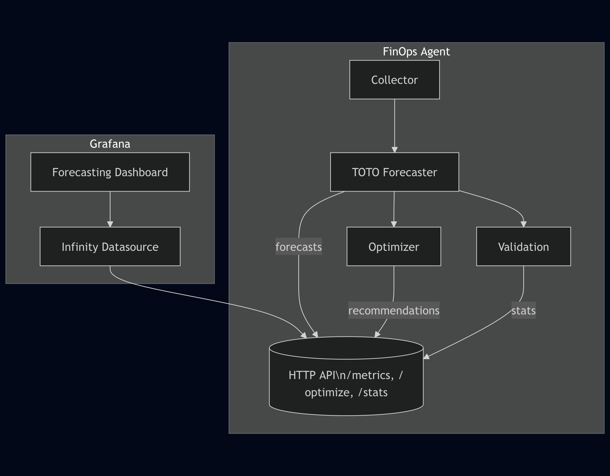

# FinOps Agent

The FinOps Agent is an AI-powered forecasting tool with deterministic optimization algorithms to provide recommendations for cloud infrastructure cost & resource usage reduction.

## Key Value Props

1. Cost Forecasting – Predict your 7 or 30-day future spend at cluster and node granularity.

2. AI-Powered – Zero-shot learning via Datadog's open-source Toto model.

3. Recommendations – Automatically spot idle nodes and estimate exact dollar-savings.

4. Plug & Play – Configure in deployments/helm-standalone/values.yaml, Helm does the rest; integrate via simple JSON APIs.


## Architecture



## Data Flow


## Project Structure

```bash
finops-agent/
├── config.yaml                        # Main configuration file
├── src/
│   ├── main.py                        # Main application entry point
│   ├── collectors/
│   │   └── prometheus.py              # Prometheus metrics collector
│   ├── adapters/
│   │   ├── forecasting/
│   │   │   └── toto_adapter.py        # Datadog TOTO zero-shot model
│   │   ├── prometheus_toto_adapter.py # Direct Prometheus to TOTO conversion
│   │   └── forecast_format_converter.py # Output format conversion
│   ├── metrics/
│   │   └── promql_queries.py          # PromQL query definitions
│   ├── validation/
│   │   └── forecast_validator.py      # Model accuracy validation
│   ├── utils/
│   │   └── node_normalizer.py         # Node name normalizer
│   └── optimizers/
│       └── idle_capacity.py           # Cost optimization logic
├── toto/                              # Upstream Datadog/Toto utility code
│   └── ...                            # TOTO model utilities and helpers
├── deployments/helm-standalone/
│   └── values.yaml                    # Helm values file
├── deployments/helm-for-kof/
│   └── values.yaml                    # Helm values file for KOF
├── deployments/kubernetes/
│   └── deployment.yaml                # Kubernetes deployment
├── deployments/k0rdent-service-template/
│   └── service-template.yaml          # k0rdent service template
└── docs/
    ├── architecture.png               # Architecture diagram
    ├── appendix.md                    # Additional documentation
    └── TOTO_TENSOR_SHAPE_GUIDE.md     # TOTO tensor format guide
```

### TOTO Model Integration

The `toto/` folder contains utility code directly from upstream [Toto](https://github.com/Datadog/TOTO) repository. This provides the necessary utilities and helper functions to leverage the TOTO zero-shot forecasting model, including tensor operations, data preprocessing, and model inference capabilities.

## Quick Start

### Prerequisites

- Access to a Prometheus instance **or** any Prometheus-compatible HTTP endpoint.
  This can be:
  - A direct Prometheus server (`http://prometheus:9090`) running inside your cluster.
  - The "KOF" proxy that exposes a Prometheus-style API.

### Docker Deployment

```bash
# Build and push Docker image
docker build -t forecasting-agent:latest .
docker push your-registry/forecasting-agent:latest
```

### Multi-Platform Docker Builds

```bash
# Build for specific platform
docker build --platform linux/amd64 -t finops-agent:latest-amd64 .
docker build --platform linux/arm64 -t finops-agent:latest-arm64 .

# Build and push to registry
docker buildx build --platform linux/amd64,linux/arm64 \
  --tag your-registry/finops-agent:latest \
  --push .
```

### K0rdent + KOF (Recommended)

> Note: Make sure that Grafana instance deployed with KOF has infinity plugin installed else install it manually. This is required for the Forecasting dashboard to work.

Deploy via k0rdent-native resources i.e., HelmRepository, ServiceTemplate, MultiClusterService.

1 Package the Helm chart

```bash
helm package deployments/helm-for-kof

export HELM_EXPERIMENTAL_OCI=1
helm push finops-agent-kof-0.1.1.tgz oci://ghcr.io/<org>/charts
```

2 Set HelmRepository, ServiceTemplate, MCS in `deployments/k0rdent-service-template`

2.a Apply the HelmRepository, ServiceTemplate `deployments/k0rdent-service-template`

```bash
kubectl apply -f deployments/k0rdent-service-template/helm-repo.yaml
kubectl apply -f deployments/k0rdent-service-template/service-template.yaml
```

2.b Verify ServiceTemplate is valid

```bash
kubectl get servicetemplate -n kcm-system
```

3 Apply the MultiClusterService resource

```bash
kubectl apply -f deployments/k0rdent-service-template/mcs.yaml
```

The `MultiClusterService` targets clusters with these labels and deploys FinOps Agent automatically:

```yaml
k0rdent.mirantis.com/management-cluster: "true"
sveltos-agent: present
```

4 Verify the resources are available

4.a Verify the MCS is applied

```bash
kubectl get mcs -n kcm-system
```

4.b Verify the FinOps Agent is deployed

```bash
kubectl get pod -n finops
```

4.c Verify that the Grafana resources are available

```bash
kubectl get grafanadashboard -n kof
kubectl get grafanadatasource -n finops
```

Read more about [k0rdent-service-template](./deployments/k0rdent-service-template/README.md)

### Kubernetes

- Patch the [kubernetes deployment resource](./deployments/kubernetes/deployment.yaml) with your public {docker-image} of Finops application.

```bash
# Apply Kubernetes deployment
kubectl apply -f deployments/kubernetes/deployment.yaml
```

### Local Development

```bash
# Install dependencies
pdm install

# Run directly
PYTHONPATH=.:src pdm run python src/main.py --config config.yaml
```

### Standalone Helm (single cluster)

```bash
# Install FinOps Agent using Helm chart
helm install finops-agent ./deployments/helm-standalone

# Install in specific namespace
helm install finops-agent ./deployments/helm-standalone --namespace finops --create-namespace

# Install with custom Prometheus URL
helm install finops-agent ./deployments/helm-standalone \
  --set config.collector.url=http://your-prometheus:9090
```

#### Grafana Dashboard

The Helm chart includes a bundled Grafana instance with pre-configured forecasting dashboards.

- Port forward to access Grafana UI
kubectl port-forward service/finops-agent-grafana 3001:3001

`
Default: Go to http://localhost:3001 - {user: admin, pass: finops123}
`

Dashboard Features

- 9 forecasting panels (4 node-level + 5 cluster-level)

- 7-day forecast horizon

## Configuration

Configure via `config.yaml`:

```yaml
# Agent runtime settings
agent:
  interval: 3600  # seconds between forecast updates

# Prometheus data source
collector:
  type: prometheus
  url: http://localhost:8082
  lookback_days: 7
  step: "1h"  # Consistent step size for all queries
  disable_ssl: true
  timeout: 300
  max_retries: 3
  chunk_days: 0.25  # 6 hours for better granular processing, and so 1 for 24 hours

# Model configuration
models:
  type: toto
  forecast_horizon: 3 # number of days ahead in future
  quantiles: [0.1, 0.5, 0.9]
  toto:
    checkpoint: Datadog/Toto-Open-Base-1.0
    device: cpu              # or cuda
    context_length: 4096
    num_samples: 256
    compile: True

# Optimizer configuration
optimizer:
  idle_cpu_threshold: 0.3
  idle_mem_threshold: 0.3
  min_node_savings: 1

# Metrics configuration
metrics:
  forecast_api_port: 8081
  forecast_api_host: "0.0.0.0"

# Validation configuration
validation:
  enabled: True
  interval_cycles: 2  # Run validation every 5 forecast cycles
  train_ratio: 0.7    # Use 70% for training, 30% for testing
  log_level: INFO

# Node normalization configuration
node_normalization:
  enabled: True
  kube_node_info_query: "kube_node_info"  # Query to get node mappings
  fallback_to_original: True  # Return original name if no mapping found
  log_mapping_stats: True  # Log mapping statistics for debugging
```

## API Endpoints

HTTP API available at `http://localhost:8081`

### Get Cluster Forecasts

`GET /metrics/{cluster_name}`

Returns forecast data for a specific cluster:

```json

{
  "forecasts": [
    {
      "metric": {
        "__name__": "cost_usd_per_cluster_forecast",
        "clusterName": "aws-ramesses-regional-0",
        "node": "cluster-aggregate",
        "quantile": "0.10",
        "horizon": "14d"
      },

      "values": [10.5, 11.2, 9.8],
      "timestamps": [1640995200000, 1640998800000, 1641002400000]
    }
    {
      .....
    }
  ],
  "metadata": {
    "total_metrics": 9,
    "total_forecasts": 63,
    "horizon_days": 7,
    "quantiles": [
      0.1,
      0.5,
      0.9
    ]
  }
}
```

### List All Metrics Across Clusters

`GET /metrics`

Returns all available metrics across all clusters:

```json
{
  "metrics": {
    "aws-ramesses-regional-0": {
      "forecasts": [
        {
          "metric": {
            "__name__": "cost_usd_per_cluster_forecast",
            "clusterName": "aws-ramesses-regional-0",
            "node": "cluster-aggregate",
            "quantile": "0.10",
            "horizon": "14d"
          },
          "values": [
            0.221269,
            .....,
          ],
          "timestamps": [
            1752461807000,
            ....,
          ]
        },
        {
          .......
        }
      ],
      "metadata": {
        "total_metrics": 9,
        "total_forecasts": 63,
        "horizon_days": 7,
        "quantiles": [
          0.1,
          0.5,
          0.9
        ]
      }
    }
  },
  "clusters_count": 1,
  "total_forecast_entries": 1
}

```

### List Available Clusters

`GET /clusters`

Returns list of clusters with forecast data:

```json
{"clusters": ["prod-cluster", "staging-cluster"], "count" : 2}
```

### Get Available stats about cluster & model

`GET /stats`

Returns list of clusters with forecast data:

```json
{
  "status": "success",
  "timestamp": "2025-07-18T12:41:48.686914",
  "validation_results": {
    "aws-ramesses-regional-0": {
      "cost_usd_per_cluster_cluster-aggregate": {
        "mae": 0.0006218099733814597,
        "mape": 0.27760169468820095,
        "rmse": 0.0006950463284738362
      },
      "cpu_pct_per_cluster_cluster-aggregate": {
        "mae": 3.592783212661743,
        "mape": 36.132195591926575,
        "rmse": 3.7026379108428955
      },
      .....
      "cpu_total_cores_per_node_aws-ramesses-regional-0-md-8snzm-stgb6": {
        "mae": 0.01127923745661974,
        "mape": 0.563961872830987,
        "rmse": 0.011976901441812515
      }
    }
  },
  "summary": {
    "cluster_count": 1,
    "clusters_with_errors": 0,
    "metrics_validated": 21,
    "average_mape": 19.9
  },
  "validation_config": {
    "train_ratio": 0.7,
    "metrics": [
      "mape",
      "mae",
      "rmse"
    ],
    "format": "toto"
  }
}
```

#### Get Available recommendations to optimize infrastructure

`GET /optimize`

Returns list of recommendations to optimize infrastructure:

```json
{
  "status": "success",
  "recommendations": [
    {
      "cluster": "aws-ramesses-regional-0",
      "type": "idle_capacity",
      "node_to_remove": "aws-ramesses-regional-0-md-8snzm-9shzt",
      "forecast_horizon_days": 7,
      "estimated_savings_usd": 7.82,
      "message": "Over the 7-day forecast, removing node 'aws-ramesses-regional-0-md-8snzm-9shzt' could save approximately $7.82."
    }
  ],
  "generated_at": "2025-07-18T10:21:16.642907"
}
```

## Documentation

For detailed implementation details and advanced configuration options, see [docs/appendix.md](docs/appendix.md).

For TOTO tensor shape specifications and data format details, refer to [docs/TOTO_TENSOR_SHAPE_GUIDE.md](docs/TOTO_TENSOR_SHAPE_GUIDE.md).

## 📊 Validation & Accuracy

The agent includes built-in forecast validation:

- **Train/Test Split**: Configurable ratio (default 70/30)
- **Metrics**: MAPE, MAE, RMSE calculated automatically
- **Frequency**: Runs every N forecast cycles (configurable)

See above section `Get Available stats about cluster & model`

## 🔧 Troubleshooting

**Prometheus Connection Failed**

- Verify Prometheus URL in `config.yaml`
- Check network connectivity: `curl http://your-prometheus:9090/api/v1/query?query=up`
- Review agent logs for detailed error messages

**High MAPE Values**

- Increase `lookback_days` for more training data
- Adjust `forecast_horizon` to shorter periods
- Check data quality and missing values

## License

Apache License - see [LICENSE](LICENSE) file for details.
